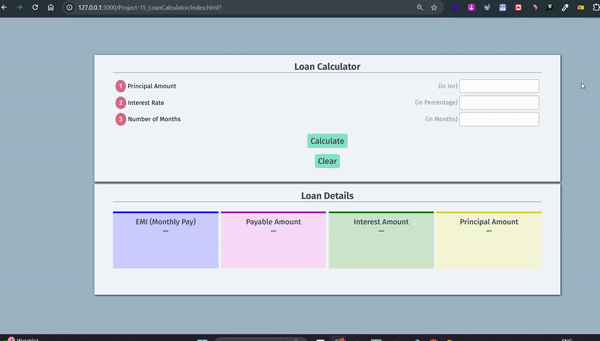

# Loan Calculator 📱
> 
 

## My Learning 📗🔖
> First time used or real use of these
> 
🖊️ 1. <input type="number"> element and step="0.01" attribute and 3 default behave of it  
🖊️ 2. <input type="button" value="Clear">  with button attribute type="button"  
🖊️ 3. parseInt() and parseFloat() use of it  
🖊️ 4. border-top: 2px solid green AND background: color-mix(in srgb, green, white 80%); 🌈 
🖊️ 5. height: auto;  
🖊️ 6. reset() method for form all input empty 

## Features 📋
⚡️ Responsive\
⚡️ good ui\
 

## Tech Stack Used 🛠️
*  HTML
*  CSS3
*  JavaScript

## Contributor 🤝
### Faheem Ahemad
